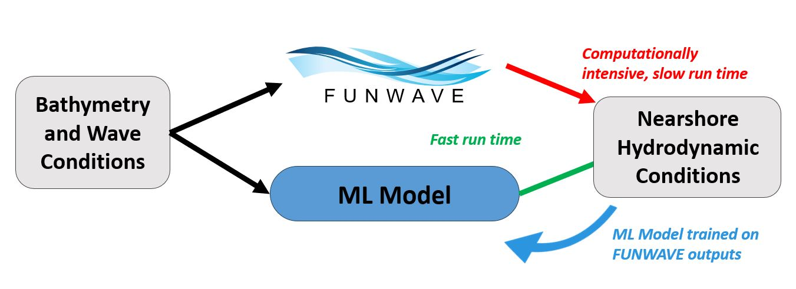

# FWML- Mass Runs of FUNWAVE 

This repository contains useful functions and scripts to run many different FUNWAVE nearshore wave simulations in an efficient
and organized manner for use in data-intensive applications such as Machine Learning

## Formatting Conventions Used Throughout this Guide
The following styling conventions will be used throughout:
* **directory names** are listed in bold blue text. 
* **parameter names/variables** are listed in bold red text
* **file names** are listed in bold green text 
* **functions/commands** are listed in bold purple text 

Specific instances of each of these used in examples are *italicized* rather than bolded.
	
## Sections

To get familiar with the general workflow, the following should be read in order:

* [**File Organization**](doc/file_structure.md): Review of the conventions for directory structures and general
code organization
* [**Generating Inputs**](doc/input_generation.md): How to generate valid input.txt files for FUNWAVE, including
options for bathymetry, coupling, and general scenarios.
* [**FUNWAVE Executables**](doc/FW_exec.md): Overview of the different versions of FUNWAVE, which each have a 
different executable.
* [**Creating SLURM Scripts**](doc/slurm/slurm_preambles.md)
* [**Executing all the Trials of a Run**](doc/running.md): Overview of the process used to automatically run
FUNWAVE runs, from input generation to output file compression/management.

## Other Workflows
* [**Using Bathymetry**](doc/bathy/make_bathy.md): Instructions on how to pass through bathymetry data for this workflow
* [**Using Coupling Files**](doc/coupling/make_coupling.md)

## Basic Organization

The FUNWAVE simulations are divided into **runs** and **trials**. Each *run* corresponds to some 
range of input parameters of FUNWAVE. Each *trial* within a run is one particular combination 
of inputs.

For example:
* A run called *varying_slopes* that consists of trials with beach slopes of 0.05,0.01, and 0.1.
  This is a single *run* with 3 *trials*.
* A run called *test_bathymetries*  that contains the same offshore input wave conditions under 
25 different bathmetry files would have be a single run with 25 *trials*.

To run a single FUNWAVE simulation, we would create a run with just 1 trial. 

### Required Inputs

For each run initiated, a **run_name** and **super_path** must be specified.
* **run_name** - the name of the run. This should be *unique* and *descriptive*. For example, 
'varying_slopes_1", "field_data_3_25", etc. This will act as a key identifier and be the name 
of several directories and structures, so chosen valid strings for whatever OS/programming
languages used.
* **super_path** - the path where all FUNWAVE inputs/outputs will be saved to. Note that as
the number of trials goes up, the number of files can quickly reach in the millions/gigabytes
of data, so ensure adequate memory. In the University of Delaware Caviness HPC system, specify
a path in the Lustre scratch folder. For example, 'lustre/scratch/user_name/'

