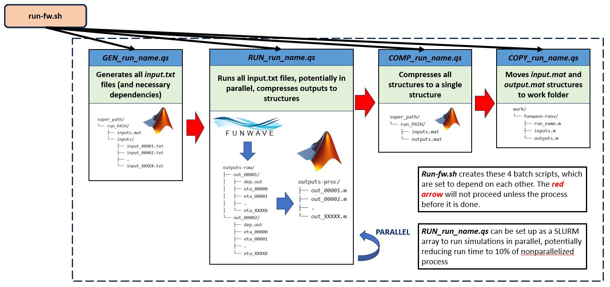

# Running the Trials of a FUNWAVE Run


## Prerequisites
Up to this point, it is assumed that *run_name.m* file defining the *input.txt* files has been created
and that a valid FUNWAVE executable has been made in *work/funwave* as described. Review these sections 
otherwise

### Specific to Caviness HPC at the University of Delaware
This workflow was developed for the *Caviness* HPC system at the University of Delaware, which has the following
important characteristics
* Uses the SLURM workload manager to submit jobs
* Uses a VALET system to load in applications

Further documentation can be found at []

Specifically, you will need to know what ***partition*** is available to you, and the relevant specs/limitations
of the partition. The ***standard*** partition should work if you are an authorized user of Caviness. Knowing
limits on task-per-node, memory, and run times are also generally useful.

The VALET system is important to use MATLAB and OpenMPI, which are both needed. In terminal and in batch scripts
that require it, we can access these  via the `vpkg_require` command:

```bash
	vpkg_require matlab
	vpkg_require openmpi
```

Additionally, you will need to specify a workgroup before anything can be done

```
	workgroup -g workgroup-name
```

### Batch Scripting and Bash Scripting
***Batch Scripting*** is utilized to make the process of running FUNWAVE en masse as automated and fast as possible.
In Caviness (and many other HPC systems), the ***Slurm Workload Manager*** is used to submit ***jobs*** to the HPC system,
which will then be submitted once enough resources are available. Generally speaking, a ***batch script*** is specified by the `.qs`
file extension, and submitted via the `sbatch` command. Suppose we have a batch script called *run_FW.qs*. We would then run it
in the HPC system by running:

```
	sbatch run_FW.qs
```
It should be noted that SLURM batch scripts contain a plethora of settings and a vast degree of customization in their preamble.
These settings can be adjusted as needed, and many settings are explicitly adjusted to optimize the workflow. Check the section 
about the Slurm Preamble for relevant settings:

***Executing Bash Scripts***- For smaller jobs and collections of commands, generic ***bash scripts*** are used. These scripts
have an `.sh` file extension and are called via the `bash` command. Suppose we have a bash script called *tidy_up.sh*. We would
run it as:

```
	tidy_up.sh
```
Note, bash scripts can actually be used to run FUNWAVE, but this is poor practice and will generally result in a terminated
job since it uses too many resources.

## Strategy for Running FUNWAVE on the HPC System
The overall strategy employed here is summed up as follows:

>***Create a bash script (.sh) that automatically generates batch scripts (.qs) and submits them to the HPC sequentially and in parallel if possible***.

The advantage of this approach is full automation and consistently in setting up run, to ultimately submit a run with 
a single command once the appropriate bash script is made. SLURM conveniently has settings that allow scripts to wait
on the execution of another script, so tasks can be specified sequentially. 

Additionally, since each trial in a run of FUNWAVE is independent from the other, this becomes an *embarassingly parallel* task
to run, meaning that we can take advantage of parallel computing capabilities to submit multiple FUNWAVE simulations at the same
time! However, one should be cautious of this in a shared cluster environment if others are using the HPC system as well.

So in this goal, a bash script is created that creates the following series of batch scripts to execute sequentially:
1. **Generation File** - Executes the *run_name.m* file that defines the range of input parameters to XXXXX individual 
input.txt files in *super_path/run_path/inputs*.

2. **Run_File** - Runs each of the input_XXXXX.txt files sequentially, and in parallel if possible. After each trial is 
executed, the results are compressed down into a single MATLAB structure *out_XXXXX.mat* using the helper function *compress_out_i.m*. (See
the section on Compression for more details). Additionally, the individual *out_XXXXX* folder is deleted once the compression
is done to save on memory. 

3. **Compression_File**- Condenses all of the *out_XXXXX.mat* structures to a single structure that ultimately contains all the results. Note
that this is still a work in progress, and the form of this will likely change with time, as large runs are currently limited by data storage and
greater-than-memory requirements.

4. **Copy File**- (Optional)- In Caviness, it is best to move things out of `lustre/scratch` once we're done, since the lustre system is
intended for short-term storage of large data and isn't owned directly by your group.

This process is summarized in the graphic below:

