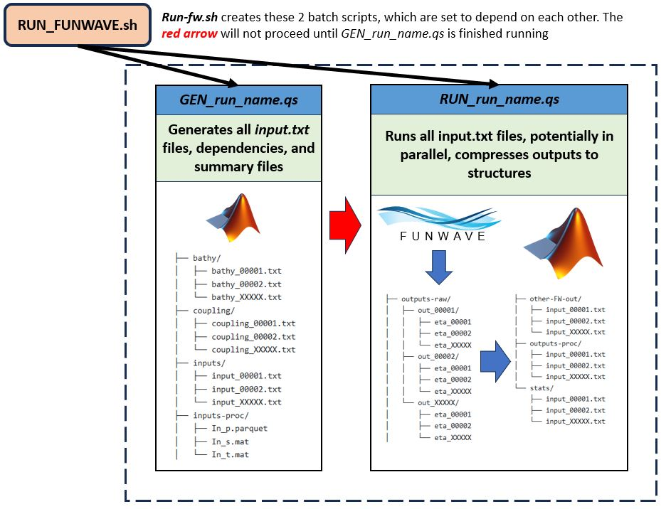

# Running the Trials of a FUNWAVE Run


## Prerequisites
Up to this point, it is assumed that ***run_name.m*** file defining the *input.txt* files has been created
and that a valid FUNWAVE executable has been made in *work/funwave* as described. Review these sections 
otherwise

### Specific to Caviness HPC at the University of Delaware
This workflow was developed for the *Caviness* HPC system at the University of Delaware, which has the following
important characteristics:

* Uses the SLURM workload manager to submit jobs
* Uses a VALET system to load in applications

Further documentation can be found at []

Specifically, you will need to know what **partitions** are available to you, and the relevant specs/limitations of the partition. The **standard** partition should work if you are an authorized user of Caviness. Knowing
limits on task-per-node, memory, and run times are also generally useful.

The VALET system is important to use MATLAB and OpenMPI, which are both needed. In terminal and in batch scripts
that require it, we can access these  via the `vpkg_require` command. These are included automatically in the bash scripts.

```bash
	vpkg_require matlab
	vpkg_require openmpi
```

Additionally, you will need to specify a workgroup before anything can be done

```
	workgroup -g workgroup-name
```

### Batch Scripting and Bash Scripting
*Batch Scripting* is utilized to make the process of running FUNWAVE en masse as automated and fast as possible.
In Caviness (and many other HPC systems), the *Slurm Workload Manager* is used to submit **jobs* to the HPC system, which will then be submitted once enough resources are available. Generally speaking, a ***batch script*** is specified by the `.qs` file extension, and submitted via the `sbatch` command. Suppose we have a batch script called ***run_FW.qs***. We would then run it
in the HPC system by running:

```
	sbatch run_FW.qs
```
It should be noted that SLURM batch scripts contain a plethora of settings and a vast degree of customization in their preamble.
These settings can be adjusted as needed, and many settings are explicitly adjusted to optimize the workflow. Check the section 
about the Slurm Preamble for relevant settings:

**Bash Scripts** : For smaller jobs and collections of commands, generic ***bash scripts*** are used. These scripts
have an `.sh` file extension and are called via the `bash` command. Suppose we have a bash script called `tidy_up.sh` (perhaps used to delte some old directories). We would
run it as:

```
	tidy_up.sh
```
Note, bash scripts can actually be used to run FUNWAVE, but this is poor practice and will generally result in a terminated
job since it uses too many resources.

## Strategy for Running FUNWAVE on the HPC System
The overall strategy employed here is summed up as follows:

>***Create a bash script (.sh) that automatically generates batch scripts (.qs) and submits them to the HPC sequentially and in parallel if possible***.

The advantage of this approach is full automation and consistently in setting up run, to ultimately submit a run with 
a single command once the appropriate bash script is made. SLURM conveniently has settings that allow scripts to wait
on the execution of another script, so tasks can be specified sequentially. 

Additionally, since each trial in a run of FUNWAVE is independent from the other, this becomes an ***embarassingly parallel*** task
to run, meaning that we can take advantage of parallel computing capabilities to submit multiple FUNWAVE simulations at the same
time! However, one should be cautious of this in a shared cluster environment if others are using the HPC system as well, since this may use a lot of resources at once.

So in this goal, a bash script is created that creates the following series of batch scripts to execute sequentially:

1. ***Generation File*** - Executes the ***run_name.m*** file that defines the range of input parameters to XXXXX individual 
`input_XXXXX.txt` files in `SUPER_PATH/RUN_PATH/inputs/`

2. ***Run_File*** - Runs each of the ***input_XXXXX.txt*** files sequentially, and in parallel if possible. After each trial is 
executed, the results are *compressed* down into a single MATLAB structure ***out_XXXXX.mat*** using the helper function `compress_i.m`. (See
the section on Compression for more details). Additional statistics are calculated on each run and executed as well 

This process is summarized in the graphic below:



## Constructing `RUN_FUNWAVE.sh`

The `RUN_FUNWAVE.sh` file is set up to be fairly modular, with just a few key input parameters to input at the beginning. **SUPER_PATH** and **RUN_NAME** are defined as before. 

### Inputs
* **count**: number of different trials in the run. This should be known ahead of time. This is needed to set the bounds of the SLURM array.
* **par**: desired partition to run on
* **tpn (tasks-per-node)**: the tasks-per-node chosen for FUNWAVE, to match with PX times PY. It is assumed that this is the same
for all runs.
* **vs (Version of FUNWAVE)**: the version of FUNWAVE to run. This should match the conventions set forth in the executables section.
* **mod (Module of FUNWAVE)**: the module (or combination of) modules to run, again matching the convention of the executables section.
* **f_list (Analysis functions)**: Analysis functions to run upon individual time series outputs after computation. See implementation details on the [`calc_stats()` function](../functions/FW-tools/output-compression/calc_stats.m).
```
## DIRECTORY SETUP AND NAME
	SUPER_PATH="/work/thsu/rschanta/RTS/data/"
	WORK_DIR="/work/thsu/rschanta/RTS/"
	RUN_NAME="debug_68"
	count="4"
# Mail-User (for Slurm)
	EMAIL_ADD="rschanta@udel.edu"
# Partition
	par="standard"
# Tasks per Node
	tpn="32"
# Version of FUNWAVE
	vs="3.6"
# Module of FUNWAVE
	mod="REG"
# List of analysis functions (enter "{}" for no functions)
	f_list="{'new_ska'}"
```

### Setup
The next section loads in bash helper functions via the `get_bash.sh` script, and exports several important variables as **Environment Variables** so they can be accessed throughout the scope of the run. (note- environment variables are UPPERCASED). The path to the FUNWAVE executable is constructure. Finally, the directories under `work/run_name/` for the batch scripts and slurm logs are created and recorded. Such that the final directory under `WORK_DIR` looks like:

```
WORK_DIR/
└── RUN_NAME/
    ├── batch-scripts/
    ├── slurm_logs/
    └── RUN_NAME.m
```

```
###################################################
# SETUP
###################################################
## Load in bash functions
	. "${WORK_DIR}functions/bash-utility/get_bash.sh"
## Export relevant environment variables
	export_vars "$SUPER_PATH" "$WORK_DIR" "$RUN_NAME" "$EMAIL_ADD"
## Path to FUNWAVE executable
	fun_ex="${WD}funwave/v${vs}/exec/FW-${mod}"
## Make log and batch folders, get their names
	create_batch_folders $RN
	slurm_dir=$(get_slurm_dir "$RN")
	batch_dir=$(get_batch_dir "$RN")
    echo "File Setup Successful!"
```

### Running the Sequence
Next, the the `GEN_run_name.qs` and `RUN_run_name.qs` batch scripts are created and run. These are detailed in the following sections:

1. [**Generation File**](running/gen_inputs.md)
2. [**Run_File**](running/run_file.md)
